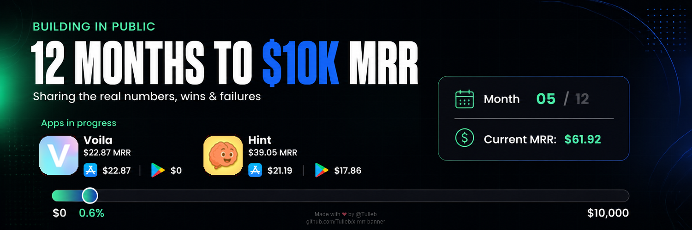

# x-mrr-banner



Update your X (Twitter) profile banner automatically with App Store Connect and Google Play revenues.

Fork this repo, run start once, and let GitHub Actions refresh the banner on a schedule. X upload is optional (`upload_to_x` in [`config.yaml`](config.yaml)); when off, CI still saves `output/banner.png` as an artifact.

## Prerequisites

- Git + a GitHub account (fork/clone as usual)
- Python **3.11+** (use `python -m pip` if `pip` isn’t on your PATH)
- [GitHub CLI](https://cli.github.com/) (`gh`) — start installs it via Homebrew when missing; otherwise `brew install gh` then `gh auth login`
- An [OpenAI API key](https://platform.openai.com/api-keys) (banner image generation)

## Quick start

```bash
git clone https://github.com/Tulleb/x-mrr-banner.git
cd x-mrr-banner
./scripts/start.sh
```

Start creates `.venv`, runs `pip install -e .`, helps with `gh`, launches the credential + preference wizard (`.env`, `config.yaml`, Actions secrets), then generates the first banner via OpenAI (`update --dry-run`).

```bash
git add config.yaml
git commit -m "Add banner preferences"
git push
```

Then run **Actions → Update X banner** on your fork (or wait for the cron).

Without start:

```bash
python3 -m venv .venv && source .venv/bin/activate
python -m pip install -e .
python -m x_mrr_banner setup   # --local-only / --github-only / --skip-config
python -m x_mrr_banner update --dry-run
```

## Commands

```bash
python -m x_mrr_banner setup
python -m x_mrr_banner update
python -m x_mrr_banner update --dry-run
python -m x_mrr_banner update --upload
```

## Configuration

[`config.yaml`](config.yaml):

| Key | Purpose |
| ----- | --------- |
| `upload_to_x` | `false` = generate only (no X API) |
| `currency` | Display label |
| `challenge` | Headline, dates, periods, start/target MRR |
| `content` | Top label, headline, subheadline, apps line |
| `theme` | Mood, style, colors for the OpenAI prompt |
| `apps` | Per-app names + Apple app SKUs, IAP/subscription Product IDs, Play packages |

The Action always updates the **previous full calendar month** (cron on the 1st, or manual dispatch). `update` fetches live revenues, renders [`inputs/BANNER.md.j2`](inputs/BANNER.md.j2), and asks OpenAI for the final `output/banner.png`.

## Secrets

| Variables | Role | GitHub Actions |
| ----------- | ------ | ---------------- |
| `ASC_*` | App Store Connect sales (Team key) | Synced by setup |
| `GOOGLE_PLAY_*` | Play bulk sales (`pubsite_prod_*` GCS) | Synced by setup |
| `X_*` | v1.1 `update_profile_banner` (OAuth 1.0a; no v2) | Synced if configured |
| `OPENAI_API_KEY` | Full banner generation via OpenAI | Synced by setup |

See [`.env.example`](.env.example). Never commit `.env`.

## How it works

1. Monthly cron (1st of month UTC) or manual workflow dispatch runs `update`.
2. Fetches Apple + Google revenues for the previous full month.
3. Renders `inputs/BANNER.md.j2` with live data + `config.yaml` preferences.
4. OpenAI generates the final banner; optionally uploads via `POST https://api.x.com/1.1/account/update_profile_banner.json`.

## Removing the watermark

Banners include a small attribution overlay by default (`watermark` in [`config.yaml`](config.yaml)):

```text
Made with ❤️ by @Tulleb
github.com/Tulleb/x-mrr-banner
```

You can turn it off (`watermark.enabled: false`) during setup or in config — totally fine. If you do, a small gesture would mean a lot:

- **Follow on X:** [@tulleb](https://x.com/tulleb) (I desperately need the visibility)
- **Share the project** by adding this to your X bio: `Banner made with https://github.com/Tulleb/x-mrr-banner/`
- **Tip Bitcoin:** `bc1q8esm8hrux2zw02vhlyk9xp20pz6mrrjxdxufuf`

Thank you — you are awesome.
